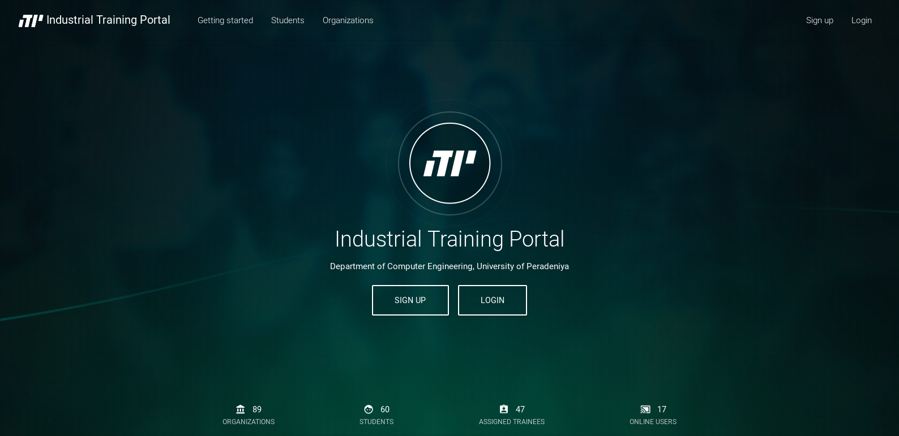
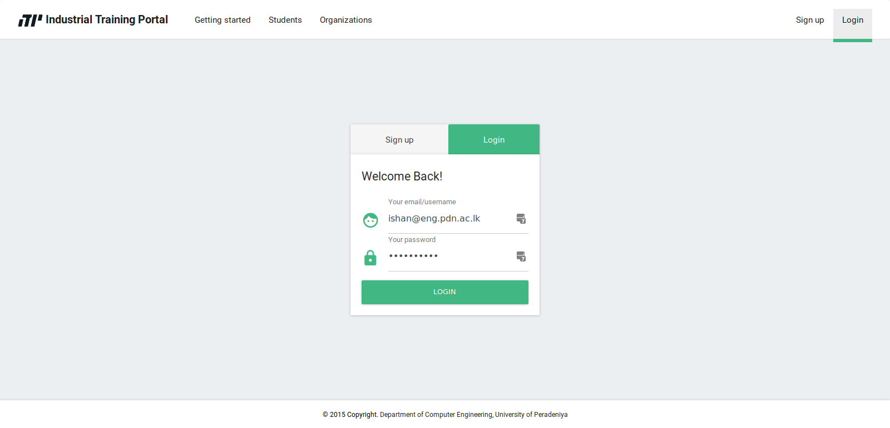

# Intelligent Training Portal - FrontEnd

This is the frontend for Intelligent Training Portal (ITPORTAL)  
You'll need the [backend implementation for ITPORTAL](https://github.com/imadx/itportal-backend-express) for complete functionality.

Get the ITPORTAL backend implementation using express from  [github.com/imadx/itportal-backend-express](https://github.com/imadx/itportal-backend-express).  

## Screenshots

Home page


Sign-in  page


## Installation
To start:

```bash
$ npm install
```

To develop:

```bash
$ npm run dev
```

To build for production:

```bash
$ npm run build
```

To lint you code:

```bash
$ npm run lint
```


---

Generated by [VuePack](https://github.com/egoist/vuepack).


## available REST services (work in progress..)
The following controller endpoints can be used within the front end components to query data from the resource server.

Refer to [express-restify-mongoose](https://florianholzapfel.github.io/express-restify-mongoose/) for available options.

Some methods accept a callback function to called in the event of success.


### `Vue.rest.getRestUrl(model, options)`
```javascript

```

### `Vue.rest.getPhotoUploadUrl(model)`
```javascript

```

### `Vue.rest.getData(model, options, cb)`

The following code snippet can be used to query data from `organization` collection with only the `name` field selected.
```javascript
Vue.rest.getData('organization', '?select=name', function(data){
	console.log(data);
})
```

### `Vue.rest.insertData(data, model, options, cb)`
```javascript

```

### `Vue.rest.updateData(data, model, options, cb)`
```javascript

```

### `Vue.rest.putImageUpload(data, model, cb)`
```javascript

```

## for custom URL calls


For custom rest services, axios object is available through the Vue object within components


### GET
```javascript
Vue.axios.get(
    _url
).then(res => {
    let _data = (res.data);
    console.log(data);
}).catch(function(err) {
    console.log(err);
});
```

### POST
```javascript
Vue.axios.get(
	_url, data
).then(res => {
    let _data = (res.data);
    console.log(data);
}).catch(function(err) {
    console.log(err);
});
```
